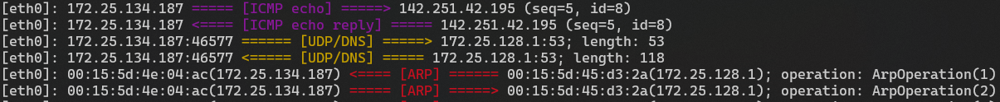

# Packet Flow

[](./LICENSE)  
Simple packet capture



## Usage

```shell
sudo path/to/packet-flow -i <NETWORK INTERFACE>
```

```
Options:
  -i, --interface <NETWORK INTERFACE>  Name of the network interface
      --noudp                          Do not display UDP
  -h, --help                           Print help
  -V, --version                        Print version
```

## Requirement

There are requirements to build for Windows.  
https://github.com/libpnet/libpnet#windows

## Contributing

Your contribution is always welcome. Please read [Contributing Guide](.github/CONTRIBUTING.md).
